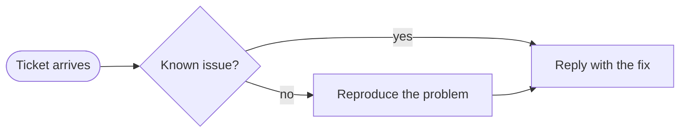
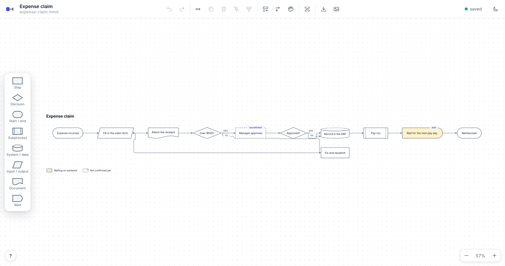
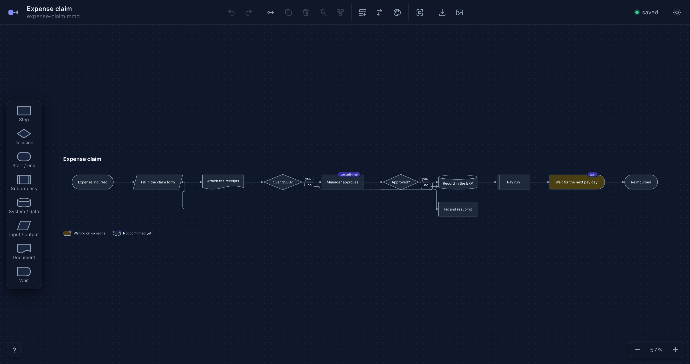

# flowmap

A local flowchart tool for process maps that two authors share: a person working in a visual editor and an AI
working in text. Both edit the same files on disk. The AI writes compact Mermaid; the person drags boxes, connects
them, renames them and exports a picture; each sees the other's changes live, because the files are the single
source of truth and the editor watches them.

Everything runs on your machine. The server binds to `127.0.0.1` only, works offline after install, and makes no
cloud calls.

The full contract is in [`docs/design.md`](docs/design.md), with rulings on open questions in
[`docs/rulings.md`](docs/rulings.md).

## Install and run

You need Node 22 or newer. The package is published to npm as `@danhannah94/flowmap` (the command it installs is
`flowmap`), so there is nothing to install first:

```sh
npx @danhannah94/flowmap serve <dir>            # the editor for every .mmd under <dir>, recursively, on http://127.0.0.1:4870
npx @danhannah94/flowmap serve <dir> --port 5000
npx @danhannah94/flowmap validate <file.mmd>
```

Or install it once and use the shorter command:

```sh
npm install --global @danhannah94/flowmap
flowmap serve <dir>
```

The examples below say `flowmap` for brevity; with `npx` that is `npx @danhannah94/flowmap`, and in a clone of this
repository it is `pnpm exec flowmap` (after `pnpm install && pnpm build`).

Open the address it prints, pick a diagram (or a folder to browse into, or start one with New diagram: a Flowchart,
or Swimlanes with a lane per role), and edit. `/?file=<path>.mmd` opens one directly (`<path>` may include folders,
e.g. `sales/stage-2.mmd`); `/?dir=<path>` opens the list browsing that folder.

The other commands (each takes the path to a `.mmd`; its config and layout files are found beside it):

| Command | What it does |
|---|---|
| `flowmap validate <file.mmd> [--json]` | Checks all three files and lists errors and warnings with their codes and lines. Exits 1 on errors. |
| `flowmap fmt <file.mmd> [--check] [--stdout]` | Rewrites the `.mmd` in canonical form. `--check` only reports; `--stdout` prints instead of writing. |
| `flowmap layout <file.mmd> [--json]` | Prints the computed layout (every lane, block and line, in pixels). |
| `flowmap export <file.mmd> --format svg\|png [--theme light\|dark] [--out <path>]` | Writes a picture to `exports/<name>.svg` or `.png` beside the `.mmd` (light theme by default). |
| `flowmap serve <dir> [--port 4870]` | Runs the editor. |

PNG export renders in headless Chromium through Playwright, which downloads its browser separately. If the browser
isn't installed, `flowmap export --format png` (and the editor's PNG button) stops with a message giving the exact
command to run once, for example `npx playwright@1.63.0 install chromium-headless-shell` (add `--with-deps` on
Linux). SVG export, the editor and every other command work without it.

## Contributing

Clone the repository and set up (Node 22 or newer, and pnpm 9 — `corepack enable` picks the right version):

```sh
pnpm install
pnpm exec playwright install chromium-headless-shell   # once; PNG export and the browser tests need it
pnpm build
```

| Command | What it runs |
|---|---|
| `pnpm typecheck` | TypeScript, no emit. |
| `pnpm test` | The unit and server tests (Vitest), including the real CLI against the fixtures. Needs the headless shell for the PNG export test. |
| `pnpm test:ui` | Builds, then runs the browser tests (Playwright) against a throwaway copy of the fixtures. Set `FLOWMAP_E2E_PORT` if the default port (4987) is taken. |
| `pnpm dev:ui` | Serves the UI with hot reload, proxying `/api` to a running `flowmap serve` (set `FLOWMAP_API` if it isn't on the default port). |

GitHub Actions runs `pnpm typecheck`, `pnpm test` and `pnpm test:ui` on every push to `main` and every pull request;
please make sure they pass locally first. Pushing a tag `v<version>` that matches `package.json` publishes that version
to npm (maintainers only).

## Folders

Diagrams can live in folders: real subdirectories of the served directory, so they work with git, the command line
and any editor. A diagram's id is its path relative to the served directory, without the `.mmd` extension
(`sales/stage-2`); a flat directory of diagrams keeps working exactly as before.

The home page shows the current folder's subfolders first, then its diagrams, with a breadcrumb (Root › sales › …)
that's remembered in the address (`?dir=sales`), so the browser's Back button retraces your steps. **New folder**
creates one in the folder you're looking at; a folder's own menu (the `···` button, like a diagram's) can rename it
or delete it, but only while it's empty — a folder with anything in it refuses, with a message saying so. New
diagrams (New diagram) are created in the folder you're in.

To move a diagram into a folder, drag its row onto the folder (or onto a breadcrumb segment, to move it up), or use
**Move to…** in its own menu, which opens a small dialog to browse to the destination and confirm. Moving a diagram
takes its `.mmd`, `.flow.yaml` and `.layout.json` (whichever exist) with it, plus anything else beside it sharing its
base name; it doesn't rewrite `link:` references to it from other diagrams (a separate feature) that point at its old
path.

Opening a diagram inside a folder, then going back to the list (the flowmap logo, top left), returns you to that
diagram's own folder, not always the root — and the editor's file name shows the full path, so you always know where
you are.

## The three files

A diagram is up to three files with the same base name, side by side. Only the `.mmd` is required.

| File | Owns | Who writes it |
|---|---|---|
| `<name>.mmd` | What the process is: lanes, steps, decisions, lines, labels. A strict subset of Mermaid flowchart syntax, so GitHub renders it too. | Both. The editor always writes canonical form (`flowmap fmt`), so diffs stay small. |
| `<name>.flow.yaml` | How it looks and what we know: the title, lane order, per-step metadata (who said it, how sure we are, quotes, open questions) and style rules that turn that metadata into looks, with a legend. | Both. The editor changes only the lines it edits; comments and formatting elsewhere survive byte for byte. |
| `<name>.layout.json` | Where things are: the positions you pinned by dragging, relative to their lane, any lane sizes you set by dragging a lane's edge, and the lanes' length if you drag their far end. | The editor (hand edits are allowed but rare). |

Why three and not two: the layout file changes on every drag, so keeping it apart means the human-edited config never
picks up noise from the editor, and neither author's edits clobber the other's.

Anything you can do by editing these files, you can do in the editor, and it writes the same result. A few things
are deliberately text-only and are kept untouched: comments in the `.mmd` (the AI's working notes), `:::class`
suffixes and `classDef`/`style` lines, and the order of statements in the `.mmd`.

## Flowcharts without lanes

Lanes are optional. A `.mmd` with no `subgraph` is a plain flowchart: no lane bands, no lane headers, just the blocks
and lines on the canvas (in the editor, the SVG and the PNG alike). Its layout is the same as any other diagram's,
with every block in the `_unassigned` lane, so `flowmap layout` and pins work as usual (a pin's `across` is simply its
distance from the top, or from the left for top-to-bottom).



In the editor, New diagram asks for **Flowchart** (no lanes) or **Swimlanes**; both create the same empty `.mmd`, and
the choice only decides what the first-steps hint suggests. In a flowchart, clicking a shape in the palette adds the
block straight away (placed automatically and opened for its label), and dragging a shape onto the canvas adds it
pinned where you drop it. Adding a lane at any time turns it into a swimlane map; the blocks you already have show in
the Unassigned lane until you move them. `flowmap validate` still notes each block that isn't in a subgraph
(`W-no-lane`); the editor doesn't list those for a diagram that has no lanes at all.




## Using the editor

**Blocks.** The palette on the left has the eight shapes (step, decision, start/end, subprocess, system/data,
input/output, document, wait). Click a shape and then click in a lane, or click a lane's empty area and then a shape,
or drag a shape into a lane (it lands pinned where you drop it). A new block opens straight into its label. Double-click
a block, or select it and press Enter, to rename it. Change its shape from the shape picker, and its id from the
inspector.

**Moving.** Drag a block to move it; it is pinned where you drop it (saved within a second). Drop it in another lane
to move it there (the lane it will land in lights up while you drag). Drop it outside every lane (below the last
one, or past their end) to make it unassigned: it moves to the Unassigned lane, pinned where you dropped it, and
while you drag, the place that lane will appear is outlined. Unpin puts selected blocks back under automatic
placement; Re-layout all clears every pin. To pan: a trackpad's two-finger scroll, hold Space and drag, or drag with
the middle button. To zoom around the cursor: a trackpad pinch, a mouse's scroll wheel, or Cmd/Ctrl+scroll; Shift+scroll
pans sideways with a mouse. Fit shows everything. There's no perfect way to tell a trackpad from a mouse wheel, so if
the guess is ever wrong for your hardware, pick Pan or Zoom instead of Auto in the controls legend (the small icon
beside the `?` button), which also lists every gesture above.

**Selecting several.** Shift-click or Cmd/Ctrl-click adds a block to the selection or takes it out. Drag on the
background to draw a box: the blocks wholly inside it are selected (with Shift held, they are added to the
selection). Cmd/Ctrl+A selects every block, Escape clears. Drag any selected block to move them all together: each
lands in the lane under its own centre and is pinned there, and the whole drop is one undo step. The arrow keys nudge
the selection by 10 px, and Delete removes it with its lines.

**Copy and paste.** Cmd/Ctrl+C copies the selected blocks with the lines between them (labels, metadata and sizes
included); Cmd/Ctrl+X cuts. Cmd/Ctrl+V pastes, in this diagram or another one open in the same browser: with the
pointer over the canvas the copy lands there (each block in the lane under it), otherwise 40 px along and across from
the originals, in the same lanes if the diagram has them (else the first lane). Pasted blocks get ids made from the
originals (`review` becomes `review-2`, then `review-3`), keep an id that's still free, and become the selection. A
copy is also put on the system clipboard as flowmap Mermaid text, so it pastes into a text editor or a chat. Cmd/Ctrl+D
duplicates the selection in place (40 px along and across, lines included) without touching the clipboard.

**Lines.** Drag from a block's connection handle (the dot on its side, shown on hover) to another block, or select a
block, press Connect and click the target. Select a line and drag either end to reconnect it. Double-click a line to
set or clear its label.

**Linking to another diagram** (amendment A15). A block can link straight to another diagram — handy for "hand-off"
steps in a set of stage diagrams ("Hand-off to 2 · Complete + save"). Select a block and use the inspector's "Links
to" field (or its context menu's "Link to diagram…") to pick one of the diagrams in the folder, or type its path:
another diagram's name, or `folder/name` for one in a subfolder, relative to the folder `flowmap serve` is serving,
without the `.mmd` extension. A linked block shows a small badge in its corner; hover it to see the target, click it
to follow the link, or hold Cmd (Ctrl elsewhere) and click anywhere on the block — a plain click still just selects
it. Following a link uses the app's own navigation, so Back returns to the diagram you came from (its pan and zoom
come back too, if you got there by following a link). `flowmap validate` and the warnings list flag a link whose
target doesn't exist (`W-link-missing`) or that climbs out of the served folder with a `..` segment
(`W-link-traversal`, which the editor also refuses to follow); linking a block to its own diagram is fine. SVG
export wraps a linked block in `<a href="<target>.svg">` so an exported set of diagrams stays clickable (PNG export
is a flat image, so this doesn't apply there).

**Lanes.** Add a lane from the toolbar and name it. Double-click a lane's header to rename it. The header's menu
(the `···` button that appears on hover) can also change the lane's id, move it up or down, or delete it. Drag a lane
header to reorder the lanes; a line shows where it will land. Deleting a lane that still has blocks asks whether to
move them to another lane (or Unassigned) or delete them with it. Blocks with no lane live in the Unassigned lane,
which always shows last. Drag a lane's far edge across the flow (its bottom, or its right side top-to-bottom) to make it
bigger, or the far end of all the lanes along the flow (the right edge, or the bottom top-to-bottom) to make them
longer; neither goes smaller than the blocks need. A double-click on the edge, or Reset size or Reset length in the lane
menu, fits them to their blocks again.

**Title and direction.** Double-click the title to edit it (empty falls back to the file name). The direction button
flips between left-to-right and top-to-bottom; pins keep their values.

**Evidence and styles.** Select a block to see its id, lane, shape, label and every metadata field in the inspector.
Add, edit or delete fields as text, a list, a map or raw YAML; values that the style rules match on are offered as
one-click choices. With several blocks selected, set or remove a field on all of them. The Styles panel lists the
rules in order with their legend text and a swatch; add, reorder and delete rules, and edit their conditions and
looks (fill, border colour, style and width, text colour, font style, badge, each with light and dark colours). A
badge is a small tag on the top edge of the block, never over its label.
Config entries for things that no longer exist show in the warnings list with a button to delete them.

**Undo.** Every edit, to any of the three files, is one undo step: Cmd/Ctrl+Z and Shift+Cmd/Ctrl+Z, or the toolbar
buttons. Undo restores all three files exactly (a file an edit created is deleted again). If a file changes on disk
from outside (the AI edited it), the view updates within a second, keeps your pan, zoom and selection, and clears
the undo history so undo can never overwrite the other author's work; the editor says when that happens.

**Safety.** Every edit saves within a second, atomically. The save indicator shows saved, saving or error. A file
with errors is shown in the error banner (code, line, message) and never overwritten; with `.mmd` errors the diagram
is read-only until the file is fixed.

**Export.** The SVG and PNG buttons write `exports/<name>.svg` or `.png` beside the `.mmd` (light theme, the same
picture as `flowmap export`) and show the path, with a button to copy it.

**Keyboard.** Press `?` (or the `?` button at the bottom left) for the full list; the small icon beside it opens the
controls legend, a compact reminder of the pan/zoom/select/edit gestures and the "Scroll to" choice. The main
keyboard ones:

| Keys | Does |
|---|---|
| Cmd/Ctrl+Z, Shift+Cmd/Ctrl+Z | Undo, redo |
| Delete or Backspace | Delete the selected blocks and lines |
| Cmd/Ctrl+C, Cmd/Ctrl+X, Cmd/Ctrl+V | Copy, cut, paste the selected blocks (and the lines between them) |
| Cmd/Ctrl+D | Duplicate the selected blocks |
| Cmd/Ctrl+A | Select every block |
| Enter | Edit the selected block's label |
| Escape | Cancel an edit, or clear the selection |
| Arrow keys | Nudge the selection 10 px (pins it) |
| `?` | Show or hide the shortcut list |

Shortcuts never fire while you are typing in an editor or a field.

## Library choices, and why

- **A custom canvas instead of React Flow** (ruling R7). The layout function decides every position, and the editor
  must show a block exactly where `flowmap layout` puts it, to the pixel. React Flow positions and measures nodes
  itself and fought those exact coordinates. The canvas is a single CSS-transformed layer of plain DOM and SVG, which
  also keeps dragging smooth on 100+ node diagrams.
- **Its own layout and router instead of ELK.** ELK has no hard fixed-position constraint, and its router doesn't
  route around nodes it didn't place, but pinned blocks must stay exactly where they were dropped and lines must
  avoid every box. flowmap's layered layout places unpinned blocks around pinned ones in lane bands and routes
  orthogonal lines itself. It is deterministic, and it keeps "hints" in the layout file so a small edit doesn't
  reshuffle unrelated boxes.
- **No server framework.** The server is a small JSON API, a server-sent-events channel and static files, on Node's
  built-in `http` and `fs`. There's nothing a framework would add, and one less dependency to keep safe.
- **Playwright for PNG export.** The SVG is rendered in headless Chromium with the same bundled Inter font the editor
  uses, so the PNG matches the SVG and the screen. Playwright is already the UI test runner, so this adds no new
  dependency.
- **`yaml` for reading the config, with minimal text edits for writing it.** The `yaml` package's `toString()`
  reformats untouched lines, so the editor splices only the byte ranges it changes (amendment A1). Comments, key
  order and odd spacing elsewhere survive.
- **Inter, bundled** (`@fontsource/inter`). Label sizes are measured against Inter's metrics, so the editor, the SVG
  and the PNG wrap labels identically, and it works offline.
- **React, Vite, Vitest, TypeScript** as the contract suggests.

## Layout of the code

- `src/core`: parsing and canonical formatting of the `.mmd`, the config and layout files, styles, the layout and
  router, SVG rendering, and every edit as a pure function over the three files (`src/core/ops`). No DOM, no file
  system. The CLI and the editor share this one core.
- `src/cli`: the `flowmap` command.
- `src/server`: static files, reading and atomically writing the three files, watching the directory, the JSON API and
  the push channel.
- `src/ui`: the editor. Every edit calls a core operation through the store (`store.apply`), which makes it one undo
  step and saves it.

## License

MIT, see [LICENSE](LICENSE).
